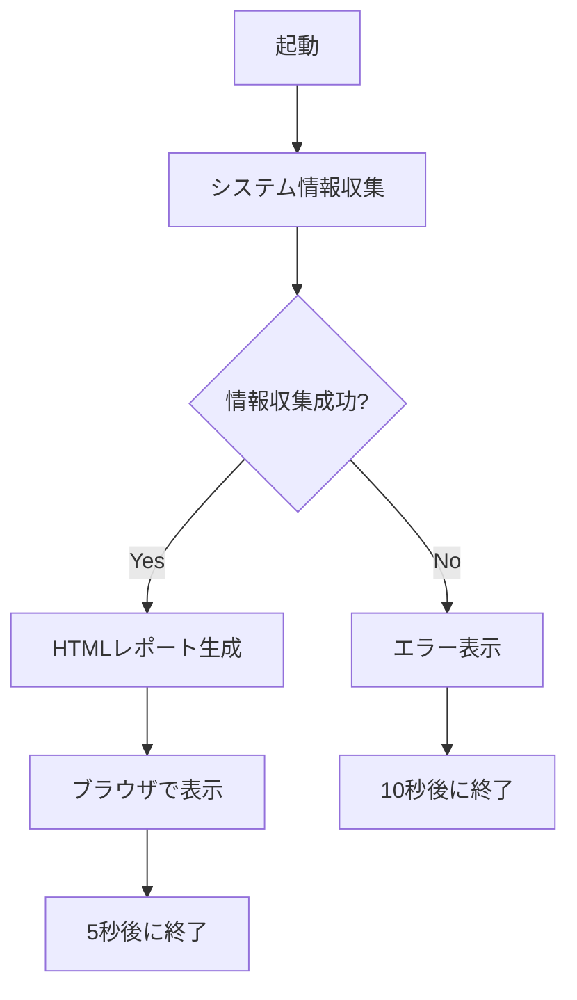

# Windows System Information Reporter
<p align="center">
    <a href="https://x.com/intent/follow?screen_name=nau_neko" target="_blank">
        
    </a>
    <a href="https://www.twitch.tv/nau_neko">
       
    </a>
    <a href="https://github.com/Pnowr/system-info-nau/blob/main/LICENSE">
        
    </a>
    <p align="center">
    <a href="https://github.com/Pnowr/system-info-nau/releases/download/1.1/system_info.exe" target="_blank">
       
    </a>
    <a href="https://github.com/Pnowr/system-info-nau">
        
    </a>
</p>
Windows PCのシステム情報を収集し、HTMLレポートを生成する可視化ツールです。

## 使い方

1. [Releases](https://github.com/Pnowr/system-info-nau/releases)から`SystemInfoReporter.exe`をダウンロード
2. ダウンロードしたexeファイルをダブルクリック　※実行したときにWindows側から警告（赤い画面）が出る場合があります。詳細を押して実行で起動できます。
3. 自動的にシステム情報を収集し、HTMLレポートを生成
4. レポートが自動的にブラウザで開きます

## トラブルシューティング

### レポートが生成されない場合
1. **管理者権限で実行**
   - exeファイルを右クリック
   - 「管理者として実行」を選択

2. **保存先の問題**
   - デフォルトではカレントディレクトリに保存
   - 書き込み権限があることを確認
   - 一時フォルダに自動的にフォールバック

3. **システム要件**
   - Windows 7以降
   - WMIサービスが有効であること
   - .NET Framework 4.5以降
4. **バージョンを下げる**
   - 最新版は安定しない為、情報を取得できない場合、バージョンを下げて実行する
   - [安定バージョン1.0](https://github.com/Pnowr/system-info-nau/releases/tag/v1.0)をインストール
### 情報が正しく取得できない場合
1. **WMIサービスの確認**
   - Windowsキー + R
   - `services.msc`を実行
   - "Windows Management Instrumentation"が実行中か確認

2. **ハードウェア情報の制限**
   - 一部のハードウェア情報は管理者権限が必要
   - BIOSの設定によっては取得できない情報あり
   - 仮想環境では一部情報が取得できない場合あり

3. **エラーメッセージの確認**
   - エラー時は10秒間メッセージを表示
   - エラーの詳細を確認して対応

## コードの構造

### メイン機能
1. **情報収集 (get_system_info)**
   ```python
   - CPU情報取得
   - メモリ情報取得
   - ストレージ情報取得
   - GPU情報取得
   - マザーボード情報取得
   - システム状態取得
   ```

2. **レポート生成 (generate_html_report)**
   ```python
   - HTML形式でレポート作成
   - レスポンシブデザイン
   - エラーハンドリング
   ```

3. **サブ機能**
   ```python
   - NVIDIAバージョン取得
   - AMDバージョン取得
   - プロセス数カウント
   - PCIe情報取得
   - TPMバージョン
   - 共有機能
   ```

### エラーハンドリング
```python
- 情報取得エラー → スキップして続行
- ファイル保存エラー → 代替保存先使用
- 権限エラー → エラーメッセージ表示
```

### 動作フロー


## クレジット
作成者: なう ([@nau_neko](https://x.com/nau_neko))

## ライセンス
MIT License
